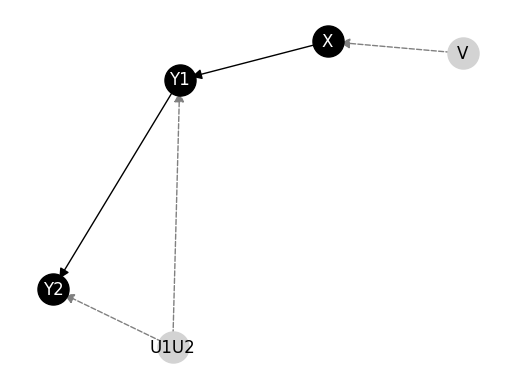

# A Binary Tree Approach to Precompute EMCC for Efficient Causal Inference

This bundle contains the manuscript submited to the journal Kybernetika and entitled  "A Binary Tree Approach to Precompute EMCC for Efficient Causal Inference".
The organisation  is the following:

- _examples_: a toy example for running the method proposed in the paper.
- _models_: set of structural causal models considered in the experimentation.
- _requirements.txt_: code dependencies.


## Setup
First of all, check the Python version. This sources have been coded with the following Python version:


```python
!python --version
```

    Python 3.9.6


Then, install the dependencies in the `requirement.txt` file. The main dependency is the python packege `bcause` (https://github.com/PGM-Lab/bcause).


```python
!pip install --upgrade pip setuptools wheel
!pip install -r ./requirements.txt
```

    Requirement already satisfied: pip in /Users/antoniogonzalezalves/PycharmProjects/bcause/venv/lib/python3.9/site-packages (25.3)
    Requirement already satisfied: setuptools in /Users/antoniogonzalezalves/PycharmProjects/bcause/venv/lib/python3.9/site-packages (80.9.0)
    Requirement already satisfied: wheel in /Users/antoniogonzalezalves/PycharmProjects/bcause/venv/lib/python3.9/site-packages (0.45.1)
    Collecting bcause@ git+https://github.com/PGM-Lab/bcause@dev-em-trees (from -r ./requirements.txt (line 1))
      Cloning https://github.com/PGM-Lab/bcause (to revision dev-em-trees) to /private/var/folders/79/kdln17f96s1b80004mkcqdxr0000gn/T/pip-install-g6wj3k4o/bcause_3238babff32d4654a7944b89c24e9ddf
      Running command git clone --filter=blob:none --quiet https://github.com/PGM-Lab/bcause /private/var/folders/79/kdln17f96s1b80004mkcqdxr0000gn/T/pip-install-g6wj3k4o/bcause_3238babff32d4654a7944b89c24e9ddf
      Running command git checkout -b dev-em-trees --track origin/dev-em-trees
      Switched to a new branch 'dev-em-trees'
      branch 'dev-em-trees' set up to track 'origin/dev-em-trees'.
      Resolved https://github.com/PGM-Lab/bcause to commit 31fd47fb260de433061ed7bcb7f184ba7769ba31
      Installing build dependencies ... [?25ldone
    [?25h  Getting requirements to build wheel ... [?25ldone
    [?25h  Preparing metadata (pyproject.toml) ... [?25ldone
    [?25hRequirement already satisfied: more-itertools==10.2.0 in /Users/antoniogonzalezalves/PycharmProjects/bcause/venv/lib/python3.9/site-packages (from -r ./requirements.txt (line 2)) (10.2.0)
    Requirement already satisfied: python-sat==0.1.8.dev15 in /Users/antoniogonzalezalves/PycharmProjects/bcause/venv/lib/python3.9/site-packages (from -r ./requirements.txt (line 3)) (0.1.8.dev15)
    Requirement already satisfied: numpy~=1.26 in /Users/antoniogonzalezalves/PycharmProjects/bcause/venv/lib/python3.9/site-packages (from -r ./requirements.txt (line 4)) (1.26.4)
    Requirement already satisfied: pyAgrum~=1.12 in /Users/antoniogonzalezalves/PycharmProjects/bcause/venv/lib/python3.9/site-packages (from -r ./requirements.txt (line 5)) (1.15.1)
    Requirement already satisfied: pandas~=2.0.3 in /Users/antoniogonzalezalves/PycharmProjects/bcause/venv/lib/python3.9/site-packages (from bcause@ git+https://github.com/PGM-Lab/bcause@dev-em-trees->-r ./requirements.txt (line 1)) (2.0.3)
    Requirement already satisfied: matplotlib~=3.5.2 in /Users/antoniogonzalezalves/PycharmProjects/bcause/venv/lib/python3.9/site-packages (from bcause@ git+https://github.com/PGM-Lab/bcause@dev-em-trees->-r ./requirements.txt (line 1)) (3.5.3)
    Requirement already satisfied: networkx~=2.6.3 in /Users/antoniogonzalezalves/PycharmProjects/bcause/venv/lib/python3.9/site-packages (from bcause@ git+https://github.com/PGM-Lab/bcause@dev-em-trees->-r ./requirements.txt (line 1)) (2.6.3)
    Requirement already satisfied: pgmpy~=0.1.17 in /Users/antoniogonzalezalves/PycharmProjects/bcause/venv/lib/python3.9/site-packages (from bcause@ git+https://github.com/PGM-Lab/bcause@dev-em-trees->-r ./requirements.txt (line 1)) (0.1.26)
    Requirement already satisfied: six in /Users/antoniogonzalezalves/PycharmProjects/bcause/venv/lib/python3.9/site-packages (from python-sat==0.1.8.dev15->-r ./requirements.txt (line 3)) (1.16.0)
    Requirement already satisfied: pydot in /Users/antoniogonzalezalves/PycharmProjects/bcause/venv/lib/python3.9/site-packages (from pyAgrum~=1.12->-r ./requirements.txt (line 5)) (3.0.3)
    Requirement already satisfied: cycler>=0.10 in /Users/antoniogonzalezalves/PycharmProjects/bcause/venv/lib/python3.9/site-packages (from matplotlib~=3.5.2->bcause@ git+https://github.com/PGM-Lab/bcause@dev-em-trees->-r ./requirements.txt (line 1)) (0.12.1)
    Requirement already satisfied: fonttools>=4.22.0 in /Users/antoniogonzalezalves/PycharmProjects/bcause/venv/lib/python3.9/site-packages (from matplotlib~=3.5.2->bcause@ git+https://github.com/PGM-Lab/bcause@dev-em-trees->-r ./requirements.txt (line 1)) (4.53.1)
    Requirement already satisfied: kiwisolver>=1.0.1 in /Users/antoniogonzalezalves/PycharmProjects/bcause/venv/lib/python3.9/site-packages (from matplotlib~=3.5.2->bcause@ git+https://github.com/PGM-Lab/bcause@dev-em-trees->-r ./requirements.txt (line 1)) (1.4.5)
    Requirement already satisfied: packaging>=20.0 in /Users/antoniogonzalezalves/PycharmProjects/bcause/venv/lib/python3.9/site-packages (from matplotlib~=3.5.2->bcause@ git+https://github.com/PGM-Lab/bcause@dev-em-trees->-r ./requirements.txt (line 1)) (24.1)
    Requirement already satisfied: pillow>=6.2.0 in /Users/antoniogonzalezalves/PycharmProjects/bcause/venv/lib/python3.9/site-packages (from matplotlib~=3.5.2->bcause@ git+https://github.com/PGM-Lab/bcause@dev-em-trees->-r ./requirements.txt (line 1)) (10.4.0)
    Requirement already satisfied: pyparsing>=2.2.1 in /Users/antoniogonzalezalves/PycharmProjects/bcause/venv/lib/python3.9/site-packages (from matplotlib~=3.5.2->bcause@ git+https://github.com/PGM-Lab/bcause@dev-em-trees->-r ./requirements.txt (line 1)) (3.1.4)
    Requirement already satisfied: python-dateutil>=2.7 in /Users/antoniogonzalezalves/PycharmProjects/bcause/venv/lib/python3.9/site-packages (from matplotlib~=3.5.2->bcause@ git+https://github.com/PGM-Lab/bcause@dev-em-trees->-r ./requirements.txt (line 1)) (2.9.0.post0)
    Requirement already satisfied: pytz>=2020.1 in /Users/antoniogonzalezalves/PycharmProjects/bcause/venv/lib/python3.9/site-packages (from pandas~=2.0.3->bcause@ git+https://github.com/PGM-Lab/bcause@dev-em-trees->-r ./requirements.txt (line 1)) (2024.1)
    Requirement already satisfied: tzdata>=2022.1 in /Users/antoniogonzalezalves/PycharmProjects/bcause/venv/lib/python3.9/site-packages (from pandas~=2.0.3->bcause@ git+https://github.com/PGM-Lab/bcause@dev-em-trees->-r ./requirements.txt (line 1)) (2024.1)
    Requirement already satisfied: scipy in /Users/antoniogonzalezalves/PycharmProjects/bcause/venv/lib/python3.9/site-packages (from pgmpy~=0.1.17->bcause@ git+https://github.com/PGM-Lab/bcause@dev-em-trees->-r ./requirements.txt (line 1)) (1.13.1)
    Requirement already satisfied: scikit-learn in /Users/antoniogonzalezalves/PycharmProjects/bcause/venv/lib/python3.9/site-packages (from pgmpy~=0.1.17->bcause@ git+https://github.com/PGM-Lab/bcause@dev-em-trees->-r ./requirements.txt (line 1)) (1.5.1)
    Requirement already satisfied: torch in /Users/antoniogonzalezalves/PycharmProjects/bcause/venv/lib/python3.9/site-packages (from pgmpy~=0.1.17->bcause@ git+https://github.com/PGM-Lab/bcause@dev-em-trees->-r ./requirements.txt (line 1)) (2.4.0)
    Requirement already satisfied: statsmodels in /Users/antoniogonzalezalves/PycharmProjects/bcause/venv/lib/python3.9/site-packages (from pgmpy~=0.1.17->bcause@ git+https://github.com/PGM-Lab/bcause@dev-em-trees->-r ./requirements.txt (line 1)) (0.14.2)
    Requirement already satisfied: tqdm in /Users/antoniogonzalezalves/PycharmProjects/bcause/venv/lib/python3.9/site-packages (from pgmpy~=0.1.17->bcause@ git+https://github.com/PGM-Lab/bcause@dev-em-trees->-r ./requirements.txt (line 1)) (4.66.5)
    Requirement already satisfied: joblib in /Users/antoniogonzalezalves/PycharmProjects/bcause/venv/lib/python3.9/site-packages (from pgmpy~=0.1.17->bcause@ git+https://github.com/PGM-Lab/bcause@dev-em-trees->-r ./requirements.txt (line 1)) (1.4.2)
    Requirement already satisfied: opt-einsum in /Users/antoniogonzalezalves/PycharmProjects/bcause/venv/lib/python3.9/site-packages (from pgmpy~=0.1.17->bcause@ git+https://github.com/PGM-Lab/bcause@dev-em-trees->-r ./requirements.txt (line 1)) (3.3.0)
    Requirement already satisfied: threadpoolctl>=3.1.0 in /Users/antoniogonzalezalves/PycharmProjects/bcause/venv/lib/python3.9/site-packages (from scikit-learn->pgmpy~=0.1.17->bcause@ git+https://github.com/PGM-Lab/bcause@dev-em-trees->-r ./requirements.txt (line 1)) (3.5.0)
    Requirement already satisfied: patsy>=0.5.6 in /Users/antoniogonzalezalves/PycharmProjects/bcause/venv/lib/python3.9/site-packages (from statsmodels->pgmpy~=0.1.17->bcause@ git+https://github.com/PGM-Lab/bcause@dev-em-trees->-r ./requirements.txt (line 1)) (0.5.6)
    Requirement already satisfied: filelock in /Users/antoniogonzalezalves/PycharmProjects/bcause/venv/lib/python3.9/site-packages (from torch->pgmpy~=0.1.17->bcause@ git+https://github.com/PGM-Lab/bcause@dev-em-trees->-r ./requirements.txt (line 1)) (3.15.4)
    Requirement already satisfied: typing-extensions>=4.8.0 in /Users/antoniogonzalezalves/PycharmProjects/bcause/venv/lib/python3.9/site-packages (from torch->pgmpy~=0.1.17->bcause@ git+https://github.com/PGM-Lab/bcause@dev-em-trees->-r ./requirements.txt (line 1)) (4.12.2)
    Requirement already satisfied: sympy in /Users/antoniogonzalezalves/PycharmProjects/bcause/venv/lib/python3.9/site-packages (from torch->pgmpy~=0.1.17->bcause@ git+https://github.com/PGM-Lab/bcause@dev-em-trees->-r ./requirements.txt (line 1)) (1.13.2)
    Requirement already satisfied: jinja2 in /Users/antoniogonzalezalves/PycharmProjects/bcause/venv/lib/python3.9/site-packages (from torch->pgmpy~=0.1.17->bcause@ git+https://github.com/PGM-Lab/bcause@dev-em-trees->-r ./requirements.txt (line 1)) (3.1.4)
    Requirement already satisfied: fsspec in /Users/antoniogonzalezalves/PycharmProjects/bcause/venv/lib/python3.9/site-packages (from torch->pgmpy~=0.1.17->bcause@ git+https://github.com/PGM-Lab/bcause@dev-em-trees->-r ./requirements.txt (line 1)) (2024.6.1)
    Requirement already satisfied: MarkupSafe>=2.0 in /Users/antoniogonzalezalves/PycharmProjects/bcause/venv/lib/python3.9/site-packages (from jinja2->torch->pgmpy~=0.1.17->bcause@ git+https://github.com/PGM-Lab/bcause@dev-em-trees->-r ./requirements.txt (line 1)) (2.1.5)
    Requirement already satisfied: mpmath<1.4,>=1.1.0 in /Users/antoniogonzalezalves/PycharmProjects/bcause/venv/lib/python3.9/site-packages (from sympy->torch->pgmpy~=0.1.17->bcause@ git+https://github.com/PGM-Lab/bcause@dev-em-trees->-r ./requirements.txt (line 1)) (1.3.0)


Import the necessary packages:


```python
import pandas as pd
import warnings
from bcause.models.cmodel import StructuralCausalModel
from bcause.util import randomUtil
from bcause.factors import MultinomialFactor

warnings.filterwarnings('ignore')
```

Check that the package can be loaded:


```python
import bcause
```

## Model and data

Load a SCM and a dataset to illustrate the use of the methods in the paper.


```python
# Define the path of the model and the data
filepath = "./models/scm/g2_model_27.bif"
datapath = "./models/data/g2_data_27.csv"
```


```python
model = StructuralCausalModel.read(filepath)
for var_name, factor in model.factors.items():
    model.factors[var_name] = MultinomialFactor(domain=factor.domain, values=factor.values, left_vars=factor.left_vars,right_vars=factor.right_vars, vtype="list")
model.graph.edges
```


    OutEdgeView([('V', 'X'), ('X', 'Y1'), ('Y1', 'Y2'), ('U1U2', 'Y1'), ('U1U2', 'Y2')])


```python
model.draw()
```


    

    


```python
data = pd.read_csv(datapath, dtype='str')[model.endogenous]
```


```python
data.head()
```


<div>
<style scoped>
    .dataframe tbody tr th:only-of-type {
        vertical-align: middle;
    }

    .dataframe tbody tr th {
        vertical-align: top;
    }

    .dataframe thead th {
        text-align: right;
    }
</style>
<table border="1" class="dataframe">
  <thead>
    <tr style="text-align: right;">
      <th></th>
      <th>X</th>
      <th>Y1</th>
      <th>Y2</th>
    </tr>
  </thead>
  <tbody>
    <tr>
      <th>0</th>
      <td>1</td>
      <td>1</td>
      <td>1</td>
    </tr>
    <tr>
      <th>1</th>
      <td>1</td>
      <td>1</td>
      <td>0</td>
    </tr>
    <tr>
      <th>2</th>
      <td>1</td>
      <td>1</td>
      <td>0</td>
    </tr>
    <tr>
      <th>3</th>
      <td>1</td>
      <td>1</td>
      <td>1</td>
    </tr>
    <tr>
      <th>4</th>
      <td>1</td>
      <td>1</td>
      <td>0</td>
    </tr>
  </tbody>
</table>
</div>


## Counterfactual inference methods

First, load corresponding modules for using EMCC, precomputed EMCC, and tree-based EMCC; along with the package to make a causal query.


```python
from bcause.inference.causal.multi import CausalMultiInference
from bcause.learning.parameter.expectation_maximization import ExpectationMaximization,ExpectationMaximizationPrecomputed,ExpectationMaximizationTrees
```

Set up the EMCC model with $N=20$ random initialization and $50$ iterations for the standard EMCC.
Then, run the causal query of probability of sufficiency of $Y1$ on $Y2$.


```python
models = []
for i in range(20):
    randomUtil.seed(i)
    model.randomize_factors(model.exogenous, allow_zero=False,in_place=True,vtype="list")
    em = ExpectationMaximization(model, vtype="list")
    em.run(data,max_iter=50)
    models.append(em.model)
inf = CausalMultiInference(models)
inf.prob_sufficiency(cause="Y1", effect="Y2",true_false_cause=("1","0"), true_false_effect=("1","0"))
```


    [0.043785350185889235, 0.7736933550463929]


Set up the EMCC model with $N=20$ random initialization and $50$ iterations for the precomputed EMCC. Then, run the causal query of probability of sufficiency of $Y1$ on $Y2$.


```python
models = []
for i in range(20):
    randomUtil.seed(i)
    model.randomize_factors(model.exogenous, allow_zero=False,in_place=True, vtype="list")
    em = ExpectationMaximizationPrecomputed(model,as_list=True)
    em.run(data,max_iter=50)
    models.append(em.model)
inf = CausalMultiInference(models)
inf.prob_sufficiency(cause="Y1", effect="Y2",true_false_cause=("1","0"), true_false_effect=("1","0"))
```


    [0.04378535018588922, 0.7736933550463929]


Set up the EMCC model with $N=20$ random initialization and $50$ iterations for the precomputed tree-based EMCC. Then, run the causal query of probability of sufficiency of $Y1$ on $Y2$.


```python
models = []
for i in range(20):
    randomUtil.seed(i)
    em = ExpectationMaximizationTrees(model.randomize_factors(model.exogenous, allow_zero=False),ignore_convergence=True)
    em.run(data, max_iter=50)
    models.append(em.model)
inf = CausalMultiInference(models)
inf.prob_sufficiency(cause="Y1", effect="Y2",true_false_cause=("1","0"), true_false_effect=("1","0"))
```
